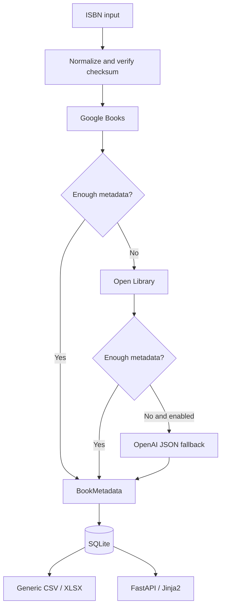

# NexaBook

> Python/FastAPI platform for automated book metadata enrichment using bibliographic APIs, structured processing and an optional LLM-assisted fallback.

NexaBook turns an ISBN into a normalized, persistent book record. It queries deterministic bibliographic sources first, merges only missing fields, optionally invokes OpenAI when metadata remains incomplete, and exports the resulting catalog as generic CSV or XLSX files.

## Overview

Manual book registration often requires searching multiple sources, reconciling inconsistent fields and recreating spreadsheet rows. NexaBook encapsulates that workflow behind a small FastAPI application with an explicit provider contract, validated domain model, SQLite repository and testable export layer.

This repository is a sanitized portfolio edition reconstructed from a real-world product workflow. It contains no customer, production or commercial catalog data and is operationally independent from the private production system.

## Key features

- Ordered metadata enrichment by ISBN.
- Google Books and Open Library adapters with bounded network timeouts.
- Optional OpenAI fallback with a prompted JSON response validated by Pydantic.
- Merge strategy that preserves stronger values already collected.
- SQLite persistence with an independently generated empty database.
- Generic CSV and XLSX exports through Pandas and OpenPyXL.
- FastAPI/Jinja2 interface with signed sessions.
- CSRF validation for state-changing forms and bounded login attempts.
- Isolated tests using temporary databases, synthetic records and mocked APIs.

## Architecture



The provider interface and orchestration are independent from HTTP and persistence. See [architecture details](docs/architecture.md).

## Data enrichment pipeline

The configured order is:

1. Normalize the ISBN and validate its ISBN-10 or ISBN-13 checksum.
2. Query Google Books.
3. If the completeness threshold has not been reached, query Open Library.
4. If metadata is still incomplete and AI fallback is explicitly enabled, query OpenAI.
5. Validate and merge only missing fields into `BookMetadata`.
6. Persist the result in SQLite.
7. Export selected public fields to CSV or XLSX.

Provider failures are isolated. A network error or invalid optional AI response does not overwrite metadata already collected.

## AI integration

OpenAI is the final, optional enrichment provider—not the source of truth and not a mandatory runtime dependency.

It receives an ISBN plus a bounded instruction describing the expected metadata fields. The Responses API must return a JSON object; the application parses it and validates it through Pydantic. Invalid JSON or incompatible output is rejected and the pipeline continues with the deterministic metadata already available. No pricing, authentication or permission decision is delegated to the model.

This is prompt-requested JSON validated locally, not OpenAI Structured Outputs or JSON mode. The SDK client uses an 8-second timeout and two retries for transient API failures.

Tests inject a fake client, so the suite never spends API credits. See [AI integration details](docs/ai-integration.md).

## Tech stack

- Python 3.12.8
- FastAPI, Starlette sessions and Jinja2
- Pydantic
- SQLite
- Requests
- OpenAI Responses API
- Google Books API and Open Library API
- Pandas and OpenPyXL
- Pytest and HTTPX

## Project structure

```text
NexaBook/
├── nexabook/
│   ├── config.py          # environment configuration
│   ├── models.py          # validated metadata contract
│   ├── providers.py       # bibliographic and LLM adapters
│   ├── services.py        # enrichment orchestration
│   ├── repository.py      # SQLite persistence
│   ├── export.py          # generic CSV/XLSX output
│   ├── security.py        # CSRF and login throttling
│   ├── web.py             # FastAPI application
│   └── templates/
├── tests/                 # isolated synthetic tests
├── examples/              # explicitly synthetic data
├── docs/
├── main.py
├── requirements.txt
└── requirements-dev.txt
```

## Getting started

Python 3.12.x is recommended.

```bash
python -m venv .venv
.venv\Scripts\activate
python -m pip install -r requirements-dev.txt
copy .env.example .env
```

For local development, authentication is disabled when `ADMIN_USERNAME` is empty. To exercise login locally, configure all three authentication variables.

## Environment variables

| Variable | Purpose |
| --- | --- |
| `APP_ENV` | `development` or `production`; production enables secure cookies and strict credential checks |
| `SECRET_KEY` | Signs session cookies; production requires at least 32 characters |
| `ADMIN_USERNAME` | Portfolio application administrator |
| `ADMIN_PASSWORD` | Administrator password |
| `GOOGLE_BOOKS_API_KEY` | Optional Google Books quota key |
| `OPENAI_API_KEY` | Optional OpenAI credential |
| `OPENAI_MODEL` | Responses API model used by the optional fallback |
| `ENABLE_OPENAI_FALLBACK` | Explicitly enables the LLM provider |
| `DATABASE_PATH` | Local SQLite file path |
| `EXPORT_DIR` | Generated export directory |
| `WEB_HOST`, `WEB_PORT` | Local server binding used by the command below |

No secret or credential is included in this repository.

## Running locally

```bash
uvicorn main:app --host 127.0.0.1 --port 8000
```

Open `http://127.0.0.1:8000`. Interactive API metadata is available at `/api/docs`.

## Tests

```bash
python -m pytest -q
python -m pip check
```

Verified on Python 3.12.10: **26 tests passed**, using mocked integrations, temporary files and synthetic metadata.

## Security

Production startup fails unless authentication is configured and the session secret has at least 32 characters. Session cookies are HttpOnly and SameSite=Lax, and become Secure in production. State-changing forms require a session-bound CSRF token, generated data is ignored by Git, and API tests are offline.

Login throttling is intentionally local and in memory: it resets on restart, is not shared across workers, and identifies clients from the direct connection IP. It is suitable only as a basic portfolio safeguard; a deployment behind a reverse proxy must define trusted proxy handling, and a multi-worker deployment needs a shared limiter. Expired entries are removed when an identity is checked, while inactive identities remain until restart.

Interactive `/api/docs` is intentionally public in production so reviewers can inspect this portfolio API. A private deployment should disable or protect it according to its threat model.

The public edition intentionally omits remote image ingestion. See [SECURITY.md](SECURITY.md) for its security boundary and disclosure guidance.

## Production background

NexaBook was developed from a real-world automation and product workflow. This public repository is an independently reconstructed portfolio edition; private implementation history, customer rules, marketplace layouts, production infrastructure and operational data are not included.

## Disclaimer and license

- All example names, records, identifiers and descriptions are synthetic.
- Private commercial content and credentials are not included.
- External API availability and returned metadata are controlled by their respective providers.
- No open-source license has been granted. Public visibility alone does not grant permission to use, modify or redistribute this code.

**LICENSE DECISION REQUIRED:** the owner may later choose a permissive license (such as MIT or Apache-2.0), a reciprocal license, or retain all rights. No `LICENSE` file is created until that decision is explicit.
