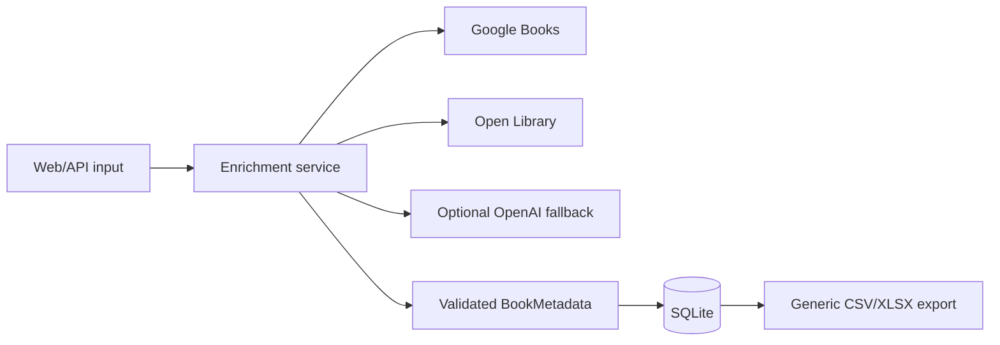

# Architecture

NexaBook separates HTTP delivery, orchestration, external providers, persistence and export concerns.

Providers return the same validated model. The enrichment service fills missing fields in configured order and stops once its quality threshold is met. Expected network, SDK and validation failures produce no candidate rather than corrupting metadata already collected. Unexpected programming errors remain visible instead of being swallowed by the fallback boundary.

The default threshold counts title, authors, publisher, description and page count, and stops after any three are populated. This avoids unnecessary external calls, but it can leave fields such as description or language empty when title, authors and publisher arrive first. The threshold is intentionally configurable; changing it is a product-quality/cost trade-off rather than a universal correctness fix.

SQLite is intentionally appropriate for this single-process portfolio application. ISBN is unique and repeated enrichment updates the existing catalog row: newer non-empty fields refresh stored values, missing values preserve existing metadata, and source labels are combined. SQLite transactions protect each write, but a production system with multiple writers would require a managed database and a shared rate-limit store.

Export is an explicit, on-demand operation after persistence rather than an automatic side effect of every enrichment request.
