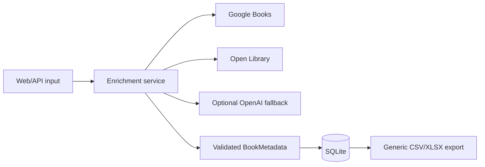

# Architecture

NexaBook separates HTTP delivery, orchestration, external providers, persistence and export concerns.

Providers return the same validated model. The enrichment service fills missing fields in configured order and stops once its quality threshold is met. Network errors produce a missing provider result rather than corrupting an existing record.

SQLite is intentionally appropriate for this single-process portfolio application. A production system with multiple writers would require a managed database and a shared rate-limit store.
